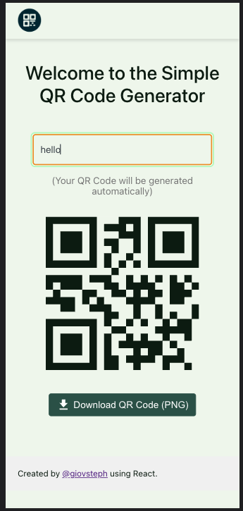
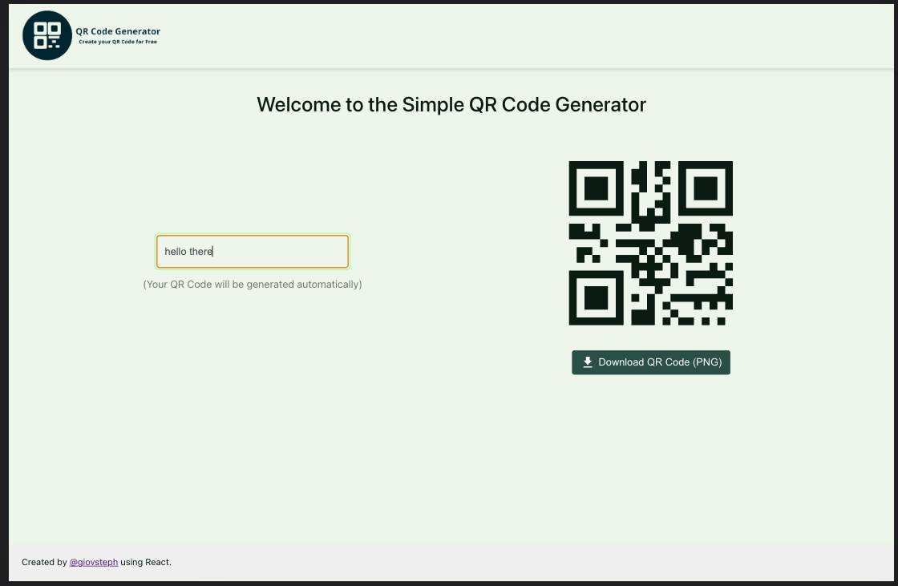

# [QR Code Generator](https://qr-generator-df60a.web.app/)

> Create your QR Code for Free

## Overview and Key Features

This project allows you to create a QR Code with text or an url and download it in a PNG format. Just type or paste your text and the QR Code will be automatically generated.

### Design Pattern

This project was created following the mobile first principle.
This project follows Atomic Design Pattern. You can learn more about it [here](https://bradfrost.com/blog/post/atomic-web-design/).

## How to run the project locally

In the project directory, you can run:

### `npm start`

Runs the app in the development mode.\
Open [http://localhost:3000](http://localhost:3000) to view it in your browser.

### `npm test`

Launches the test runner in the interactive watch mode.\
See the section about [running tests](https://facebook.github.io/create-react-app/docs/running-tests) for more information.

## Screenshots

